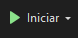

# 🛒 TintSys

O projeto **TintSys** é um sistema de **gestão de vendas desenvolvido** como atividade prática para alunos do curso técnico em Informática. Ele simula o funcionamento de um **mercado**, permitindo o **cadastro e controle de clientes, produtos, pedidos, pagamentos e usuários.**

Desenvolvido com **C# e Windows Forms**, o projeto oferece ao aluno a oportunidade de aplicar na prática conceitos fundamentais de **programação orientada a objetos (POO)**, estruturação de dados, interface gráfica, e persistência em banco de dados.

A proposta é proporcionar um ambiente completo de aprendizagem sobre desenvolvimento desktop com **C#**, usando uma arquitetura dividida entre **lógica de negócios (TintSysClass) e interface (TintSysDesk)**.

---


## 📋 Sumário

- [Sobre o Projeto](#sobre-o-projeto)
- [Funcionalidades](#funcionalidades)
- [Tecnologias Utilizadas](#tecnologias-utilizadas)
- [Pré-requisitos](#pré-requisitos)
- [Como Executar o Projeto](#como-executar-o-projeto)
- [Licença](#licença)

---


## 📌 Sobre o Projeto

O **TintSys** é um sistema de **gestão comercial para um mercado**, construído com **C#** e **Windows Forms**, com separação entre **lógica de negócios (TintSysClass)** e **interface gráfica (TintSysDesk)**.

A camada de lógica contém classes para entidades como Cliente, Produto, Pedido, ItemPedido, Pagamento, Caixa e Usuario, estruturadas com princípios de **POO** e integradas por meio de métodos **CRUD**.

A interface gráfica, construída com **Windows Forms**, possui formulários para cadastro e controle de dados, incluindo telas de produtos, clientes, usuários e pedidos. O projeto é adequado para aplicação local com banco de dados embutido e oferece boa base para evolução em projetos de ERP desktop. As principais ferramentas usadas é:

- C#
- .NET
- MySQL 

---


## 🚀 Funcionalidades

- 🌐 POO - (Programção Orientada a Objetos);
- ⚙️ CRUD;
- 👨‍💻 Autenticação de usuário;
- 🚫 ACL (Controle de Acesso) dos usuários.

---


## 🧰 Tecnologias Utilizadas

- C#
- .NET
- MySQL
- Windows Forms

---


## ⚙️ Pré-requisitos

Certifique-se de ter instalado:

- [Visual Studio](https://visualstudio.microsoft.com/pt-br/)

---


## ▶️ Como Executar o Projeto

1. **Clone o repositório**

```bash
git clone https://github.com/maugois/TintSys
```

2. **Execute o projeto**

Após abrir o projeto no visual studio 2022, aperte o botão no topo como está na imagem abaixo:



---


## 📕 Licença

Este projeto está licenciado sob a Licença MIT. 
Veja o arquivo LICENSE para mais detalhes.

Veja o arquivo [LICENSE](LICENSE) para mais detalhes.   
